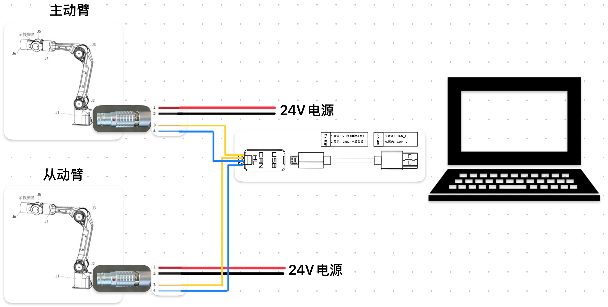

# LeRobot Piper for LeRobot 0.4.3

This repository adds AgileX Piper support to LeRobot 0.4.3.

It is based on the Piper integration work from [WeGo-Robotics/lerobot_piper](https://github.com/WeGo-Robotics/lerobot_piper.git), which targeted LeRobot 0.3.3. The Piper pieces have been refactored here to fit the LeRobot 0.4.3 robot/teleoperator config structure, factory utilities, and CLI workflow.

## What Is Included

- `PiperMotorsBus`, a Piper SDK-backed motor bus implementation
- `piper_follower`, a LeRobot `Robot` type for the follower arm
- `piper_leader`, a LeRobot `Teleoperator` type for the leader arm
- Factory registration so the Piper devices can be created from CLI arguments
- CAN setup scripts for stable leader/follower interface names
- Example scripts for teleoperation, dataset recording, and HIL recording

Most of the repository remains the upstream Hugging Face LeRobot 0.4.3 codebase.

## Key Files

```text
src/lerobot/motors/piper/
  piper.py                          PiperMotorsBus wrapper around the Piper SDK
  tables.py                         Piper motor model and initialization values

src/lerobot/robots/piper_follower/
  config_piper_follower.py          LeRobot robot config registration
  piper_follower.py                 Follower arm, cameras, observations, actions

src/lerobot/teleoperators/piper_leader/
  config_piper_leader.py            LeRobot teleoperator config registration
  piper_leader.py                   Leader arm action source

src/lerobot/scripts/
  lerobot_record_singleport.py      Single-port/direct recording flow
  lerobot_record_HIL_joint_delta.py HIL recording flow with a policy in the loop

1_init_can.sh                       CAN interface setup and renaming helper
2_teleop.sh                         Leader-follower teleoperation example
3_doubleport_record.sh              Dual-port dataset recording example
4_singleport_record.sh              Single-port/direct recording example
5_HIL_record.sh                     HIL joint-delta recording example
```

## Requirements

- Python 3.10 
- AgileX Piper arm hardware
- CAN adapters for the leader/follower examples
- Piper SDK Python packages:
  - `piper_sdk`
  - `wego_piper`

Install this checkout in editable mode:

```bash
pip install -e .
```

For the full dependency set used by this checkout:

```bash
pip install -r requirements-ubuntu.txt
```

If `piper_sdk` or `wego_piper` is missing, install the Piper SDK dependencies from your Piper SDK distribution.

## CAN Setup

`1_init_can.sh` is a Linux SocketCAN helper. It maps physical USB bus locations to stable CAN names so the rest of the scripts can refer to predictable ports:

```bash
bash 1_init_can.sh
```

The default names are:

```bash
can_leader:1000000
can_follower:1000000
```

Before running it on a new machine, edit the `USB_PORTS` table in `1_init_can.sh`. Each physical USB port should map to the interface name and bitrate you want to use.

You can inspect detected CAN interfaces with:

```bash
ip -br link show type can
```

## Teleoperation

After the CAN interfaces are ready, start leader-follower teleoperation:

```bash
bash 2_teleop.sh
```

The core command is:

```bash
lerobot-teleoperate \
  --robot.type=piper_follower \
  --robot.port=can_follower \
  --robot.id=follower \
  --teleop.type=piper_leader \
  --teleop.port=can_leader \
  --teleop.id=leader \
  --display_data=true
```

The example script also configures two OpenCV cameras. Update `/dev/video*`, resolution, and FPS values for your camera setup.

## Recording Datasets

This repository includes three recording entry points. They share the same basic LeRobot dataset flow, but they are meant for different hardware/control setups.

### Dual-port leader-follower recording

```bash
bash 3_doubleport_record.sh
```

Use this for the standard two-arm setup. The leader arm is connected through `can_leader`, the follower arm through `can_follower`, and LeRobot records the follower observations, commanded actions, and camera frames as a dataset. This is the usual choice when collecting demonstrations by physically moving the leader arm.

### Single-port/direct recording

```bash
bash 4_singleport_record.sh
```
<p align="center">
  
</p>

Use this when the leader and follower arms are directly connected over CAN, with the PC attached through a single USB-CAN interface. The leader arm already commands the follower arm at the hardware level, so both arms move together. It records the follower observations and stores the follower's current joint/gripper state as the dataset action.

### HIL joint-delta recording

```bash
bash 5_HIL_record.sh
```

Use this when a trained policy controls the follower arm by default, but a human operator can temporarily intervene through the leader arm when the policy needs correction. During intervention, the script records the leader arm's movement as a joint delta from the moment intervention starts, applies that delta to the follower, and saves the corrected action.

After the correction, intervention mode can be disabled and the policy resumes from the updated robot state. This is useful for collecting policy rollouts with human corrections instead of fully manual demonstrations.

## Safety Notes

- Check CAN interface names before enabling the robot.
- Keep the robot workspace clear before teleoperation or recording.
- Confirm camera indices and dataset destinations before long sessions.
  between the requested target and current follower position.

## Related Projects

- [WeGo-Robotics/lerobot_piper](https://github.com/WeGo-Robotics/lerobot_piper.git):
  Piper support for LeRobot 0.3.3, used as the main reference for this refactor.
- [agilexrobotics/piper_sdk](https://github.com/agilexrobotics/piper_sdk): the
  official Piper robot arm SDK used by the Piper motor bus layer.
- [huggingface/lerobot](https://github.com/huggingface/lerobot): the upstream
  LeRobot project that provides the dataset, training, policy, and CLI tooling.
